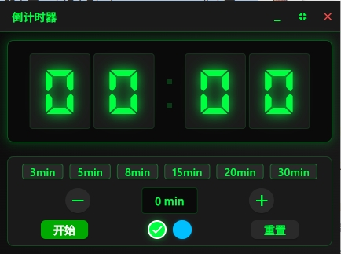
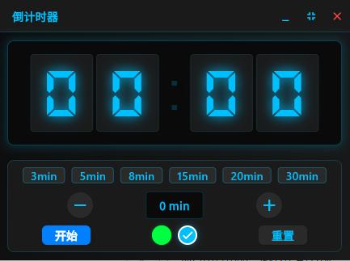

# DownTimer

<div align="center">




**一个优雅的跨平台桌面倒计时工具**

[](https://flutter.dev/)
[](https://dart.dev/)
[](LICENSE)
[](https://flutter.dev/multi-platform)
[](https://github.com/yourusername/DownTimer)

</div>

---

## 🌟 简介

DownTimer 是一个基于 Flutter 开发的跨平台桌面倒计时应用，专为提升工作效率而设计。它采用经典的 LED 数字显示风格，提供简洁直观的用户界面和丰富的功能特性。

## ✨ 核心特性

### ⏱️ 倒计时功能
- 🎯 **精确计时** - 支持分钟和秒的精确倒计时显示
- ⚡ **快捷设置** - 预设 15/30/45/60 分钟快捷按钮
- 🔧 **微调控制** - +/- 按钮支持分钟级别的精确调整
- 🎮 **完整控制** - 开始、暂停、重置功能一应俱全

### 🖥️ 窗口体验
- 📱 **双模式切换** - 完整窗口模式和最小化LED模式
- 🎨 **LED显示** - 逼真的数字LED显示屏效果
- 📍 **自由拖拽** - 支持窗口位置自由调整
- 📌 **置顶显示** - 可设置窗口始终置顶
- 🔄 **自适应大小** - LED字体随窗口尺寸智能调整

### 🎨 视觉设计
- 🌙 **主题支持** - 绿色和蓝色主题切换
- 🚨 **警告提示** - 倒计时最后10秒背景颜色警告
- 🎭 **字体定制** - 使用专业的LED数字字体
- 💫 **流畅动画** - 精心设计的过渡效果

## 🚀 快速开始

### 系统要求
- **Flutter SDK**: >= 3.0.0
- **Dart SDK**: >= 3.0.0
- **操作系统**: Windows 10+ / Linux (Ubuntu 18.04+)
- **内存**: 至少 4GB RAM
- **存储**: 100MB 可用空间

### 安装步骤

#### 1. 克隆项目
```bash
git clone https://github.com/jiehanlin/downtimer.git
cd DownTimer
```

#### 2. 安装依赖
```bash
flutter pub get
```

#### 3. 运行应用
```bash
# 开发模式
flutter run

# 指定平台运行
flutter run -d windows    # Windows
flutter run -d linux      # Linux
```

## 📦 构建部署

### Windows 构建
```bash
# 发布版本
flutter build windows --release

# 输出位置
# build/windows/runner/Release/
```

### Linux 构建
```bash
# 安装依赖 (Ubuntu/Debian)
sudo apt-get update
sudo apt-get install clang cmake ninja-build pkg-config libgtk-3-dev liblzma-dev

# 发布版本
flutter build linux --release

# 输出位置
# build/linux/x64/release/bundle/
```


## 📖 使用指南

### 基础操作

| 操作 | 方法 | 说明 |
|------|------|------|
| 设置时间 | 点击快捷按钮或使用 +/- | 支持1-120分钟范围 |
| 开始计时 | 点击"开始"按钮 | 开始倒计时 |
| 暂停计时 | 点击"暂停"按钮 | 暂停当前计时 |
| 重置计时 | 点击"重置"按钮 | 恢复到初始设置 |
| 切换模式 | 双击LED显示区域 | 完整/精简模式切换 |
| 移动窗口 | 拖拽标题栏 | 自由调整位置 |
| 置顶窗口 | 点击置顶按钮 | 保持窗口在最前 |

### 快捷操作
- **双击LED区域** - 快速切换窗口模式
- **鼠标滚轮** - 快速调整时间（开发中）
- **右键菜单** - 快捷设置选项（开发中）

## 🛠️ 技术架构

### 核心技术栈
```yaml
框架: Flutter 3.0+
语言: Dart 3.0+
状态管理: Provider 6.1.1
窗口管理: 
  - window_manager 0.3.3
  - bitsdojo_window 0.1.1+1
本地存储: shared_preferences 2.2.2
UI设计: Material Design 3
字体: 
  - Noto Sans SC (中文支持)
  - DS Digital (LED显示)
```

### 项目结构
```
lib/
├── main.dart                    # 应用程序入口点
├── app.dart                     # 主应用组件
├── models/                      # 数据模型层
│   └── timer_model.dart         # 计时器状态管理
└── widgets/                     # UI组件层
    ├── led_display.dart         # LED数字显示组件
    ├── control_panel.dart       # 控制面板组件
    └── window_controls.dart     # 窗口控制组件
```

### 设计模式
- **Provider模式** - 状态管理和数据传递
- **MVVM架构** - 分离业务逻辑和UI展示
- **响应式编程** - 基于Stream的事件处理

## 🗺️ 开发路线图

### 已完成 ✅
- [x] 基础倒计时功能
- [x] LED数字显示效果
- [x] 窗口模式切换
- [x] 跨平台支持
- [x] 快捷时间设置
- [x] 窗口置顶功能

### 开发中 🚧
- [ ] 计时结束通知提醒
- [ ] 声音提示功能
- [ ] 鼠标滚轮时间调整
- [ ] 右键快捷菜单

### 计划中 📋
- [ ] 多语言支持 (中文/英文)
- [ ] 自定义主题颜色
- [ ] 倒计时历史记录
- [ ] 键盘快捷键支持
- [ ] 导出/导入设置
- [ ] 系统托盘集成

## 🤝 贡献指南

我们欢迎所有形式的贡献！请遵循以下指南：

### 开发环境设置
1. **Fork项目** 到你的GitHub账户
2. **克隆** 你的Fork到本地
3. **创建** 功能分支：`git checkout -b feature/your-feature`
4. **安装** 依赖：`flutter pub get`
5. **开发** 你的功能
6. **测试** 确保功能正常：`flutter test`
7. **提交** 更改：`git commit -m 'Add some feature'`
8. **推送** 分支：`git push origin feature/your-feature`
9. **创建** Pull Request

### 代码规范
- 遵循 [Dart官方代码风格](https://dart.dev/guides/language/effective-dart/style)
- 使用 `flutter analyze` 检查代码质量
- 为新功能编写单元测试
- 更新相关文档和注释

### 问题报告
请使用 [Issues](https://github.com/jiehanlin/downtimer/issues) 报告问题，包含：
- 详细的问题描述
- 复现步骤
- 系统环境信息
- 相关截图或日志

## 📊 版本历史

### v1.0.0 (2024-11-26) - 初始发布
- 🎉 首次公开发布
- ⏰ 完整的倒计时功能
- 🖥️ Windows和Linux支持
- 🎨 LED数字显示效果
- 📱 双模式窗口切换

### v1.1.0 (2024-12-02) - 功能增强
- ✨ 新增窗口置顶功能
- 🎨 优化LED显示效果
- 🔧 改进窗口管理
- 🐛 修复已知问题

## 📄 开源协议

本项目采用 [MIT License](LICENSE) 开源协议。

## 🙏 致谢

感谢以下开源项目和贡献者：

- [Flutter团队](https://flutter.dev/) - 优秀的跨平台开发框架
- [Material Design](https://m3.material.io/) - 现代化的设计语言
- [Google Fonts](https://fonts.google.com/) - 优质的开源字体
- 所有为DownTimer贡献代码和想法的开发者

## 📞 联系方式

- **项目主页**: [https://github.com/jiehanlin/downtimer](https://github.com/jiehanlin/downtimer)
- **问题反馈**: [GitHub Issues](https://github.com/jiehanlin/downtimer/issues)
- **功能建议**: [GitHub Discussions](https://github.com/jiehanlin/downtimer/discussions)
- **邮箱**: jiehanlin@qq.com

---

<div align="center">

**⭐ 如果这个项目对你有帮助，请给我们一个Star！**

**🔗 分享给更多需要倒计时工具的朋友**

Made with ❤️ by [jiehanlin](https://github.com/jiehanlin/downtimer)

</div>